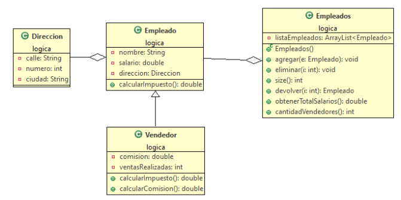

## PRACTICO 5

### Realizar un proyecto Practico5 con dos paquetes.
1) En el paquete logica, las clases que puede ver en el siguiente diagrama de clases.

  

#### **Empleado: Métodos Específicos**

• **calcularImpuesto(): double** El método retorna el 25% del salario

#### **Vendedor: Métodos Específicos**

• **calcularImpuesto(): double** Sobreescribe el método calcularImpuesto del empleado y le adiciona un 5% más

• **calcularComisión():double** Retorna un 20% de las ventas realizadas

#### **Empleados: Métodos Primitivos**

• **public void agregar(Empleado e)** Recibe un empleado y lo inserta en la lista

• **public void eliminar( Empleado e)** Recibe un empleado y lo elimina de la lista

• **public Articulo devolver(int i)**  Devuelve el articulo de la posición i

• **public int cantidad()** Devuelve cantidad de articulos de la lista

#### **Empleados: Métodos Específicos**

• **public int cantidadVendedores()**  Devuelve la cantidad de vendedores  de la lista

• **public double obtenerTotalSalarios()**  Devuelve la suma de todos los salarios de los empleados de la lista

• **public String toString()**  Devuelve un String con la información de los empleados de la lista

2) En el paquete consola: Crear la clase **Principal** cargar varios objetos de Vendedor y Empleado en la lista de Empleados, comprobar que todos los métodos funcionan de manera correcta.

